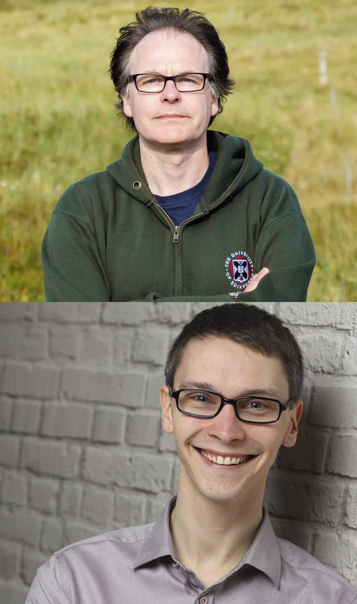

**(Multilevel) Regression analyses for single-case data with scan**

Regression analyses play an increasing role in processing single-case data. Throughout the last couple of years, several methodological improvements and refinements helped to mitigate or sometimes even get rid of concerns formerly raised over applying regression analyses to single-case data. This workshop will address several of these improvements. We will scrutinize which regression model matches specific single-case designs and associated statistical hypotheses. Moreover, we will look into multilevel models, multivariate analyses, and modeling autocorrelated residuals. We will demonstrate how to use the statistical program R to accomplish these analyses. Including coding and visualizing single-case data and regression results. Please "bring" a running R installation (RStudio as a preferable IDE) to the workshop. Most of the examples will be analysed with the R package scan. Moreover, we will send further instructions on the installation of the R package scan a few days prior to the workshop. This course is addressing researchers with already basic knowledge of regression analysis and basic familiarity with R.

We are looking forward meeting you at the online conference!

Jürgen & Timo

+-------------------+------------------------------------------------------------------------------------------------------+
| **Conference**    | [{width="138"}](https://ppw.kuleuven.be/ogp/smallisbeautifulagain2021) |
+-------------------+------------------------------------------------------------------------------------------------------+
| **Workshop**      | Multilevel regression analysis for single-case data with scan                                        |
+-------------------+------------------------------------------------------------------------------------------------------+
| **Date and time** | Thursday 15 April 2021, 10.00-12.00 CET                                                              |
+-------------------+------------------------------------------------------------------------------------------------------+
| **Instructors**   | Jürgen Wilbert & Timo Lüke                                                                           |
+-------------------+------------------------------------------------------------------------------------------------------+
