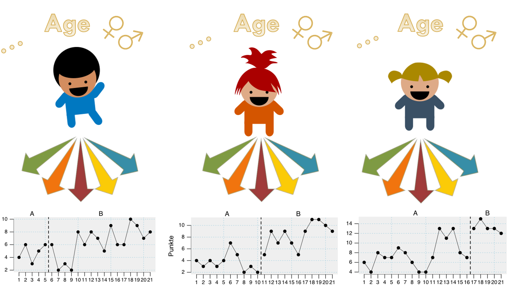

```{r setup, include=FALSE}
knitr::opts_chunk$set(
	echo = FALSE,
	message = FALSE,
	warning = FALSE,
	comment = ''
)

library(scan)
library(knitr)
library(kableExtra)
library(tidyverse)
```

# My general perspective on <br> single-case data

## Statistics is modeling the world

- Statistical models are "translations" of (scientific) hypotheses and entities.
- The formulation of the correct model is a crucial and insightful process.
- When we have a "good" statistical model we can draw valid conclusions.

- Single-case data are ... "just" data.
- We don't need a new statistic for analyzing single-case data.
- We "just" need good models.

# A basic model

## Component 1: The intercept

```{r figure_plm_intercept, echo = FALSE, fig.height=4, fig.width=6}
ex <- scdf(c(A = 1,1,1,1,1,1,1,1,1,1, B = 1,1,1,1,1,1,1,1,1,1), name = "")
plot(ex, ylim = c(0,12))
mtext("Intercept", side = 1, adj = 0, at = -0.04, line = -2, col = "blue", font = 3)
```

$y_i = \beta_0$

## Component 2: Trend effect

```{r figure_trend, echo = FALSE, fig.height=4, fig.width=6}
ex <- scdf(seq(from = 0.1, by = 0.1, length = 20), name = "", phase.design = c(A = 10, B = 10))
plot(ex, ylim = c(0,12))
mtext("trend effect", side = 1, adj = 0, at = 0.15, line = -2.5, col = "blue", font = 3)

```

$y_i = \beta_1 MT_i$

## Component 3: Level effect

```{r figure_level, echo = FALSE, fig.height=4, fig.width=6}
ex <- scdf(c(rep(0, 10), rep(5,10)), name = "", phase.design = c(A = 10, B = 10))
plot(ex, ylim = c(0,12))
mtext("level effect", side = 1, adj = 0, at = 0.4, line = -3.7, col = "blue", font = 3)
```

$y_i = \beta_2 Phase_i$

## Component 4: Slope effect

```{r figure_slope, echo = FALSE, fig.height=4, fig.width=6}
ex <- scdf(c(rep(0, 10), seq(by = 0.5, length = 10)), name = "", phase.design = c(A = 10, B = 10))
plot(ex, ylim = c(0,12))
mtext("slope effect", side = 1, adj = 0, at = 0.6, line = -10, col = "blue", font = 3)
```

$y_i = \beta_3 (MT_i-\sigma) \times Phase_i$\
$\sigma$ := MT at which Phase B starts minus one (Berry & Lewis-Beck)\
------ Alternative: $\sigma$ := MT at which Phase B starts (Huitema & McKean)

## Component 5: Error/Residual

```{r figure_error, echo = FALSE, fig.height=4, fig.width=6}
set.seed(1334)
ex <- scdf(rnorm(20, sd = 1), name = "", phase.design = c(A = 10, B = 10))
plot(ex, ylim = c(-6,6))
mtext("error/residuals", side = 1, adj = 0, at = 0.2, line = -12, col = "blue", font = 3)
```

$y_i = \epsilon_i$

## The full model

```{r figure_plm, fig.height=4, fig.width=6}
ex <- scdf(c(A = 1,3,3,4,2,3,4,5,4, 4, B = 8,7,8,9,9,7,11,10,10,13), name = "")
plot(ex, lines = list("trend", col = c("red", "blue"), lwd = 3))
mtext("Intercept", side = 1, adj = 0, at = -0.04, line = -2, col = "blue", font = 3)
mtext("level effect", side = 1, adj = 0, at = 0.4, line = -3.7, col = "blue", font = 3)
mtext("slope effect", side = 1, adj = 0, at = 0.6, line = -10, col = "blue", font = 3)
mtext("trend effect", side = 1, adj = 0, at = 0.15, line = 0.5, col = "blue", font = 3)

```

$y_i = \beta_0 + \beta_1 MT_i + \beta_2 Phase_i + \beta_3 (MT_i-\sigma) \times Phase_i + \epsilon_i$

## Example: First visualize the data

```{r ex_plm, fig.height=4, fig.width=6}
dat <- scdf(c(A = 3,2,4,5,3,2,3, B = 5,5,4,6,7,6,8,9,8,9))
plot(dat)
```

## Second: Describe the data {.columns-2}

```{r}
dat <- scdf(c(A = 3,2,4,5,3,2,3, B = 5,5,4,6,7,6,8,9,8,9))
describeSC(dat)
```

```{r fig.height=3, fig.width=4}
dat <- scdf(c(A = 3,2,4,5,3,2,3, B = 5,5,4,6,7,6,8,9,8,9))
plot(dat)
```

## Third: Fit a statistical model

<div style="float: left; width: 60%;">

```{r}
plm(dat)
```

</div>

<div style="float: right; width: 40%;">

```{r fig.height=3, fig.width=4}
dat <- scdf(c(A = 3,2,4,5,3,2,3, B = 5,5,4,6,7,6,8,9,8,9))
plot(dat)
```

</div>

## Task: Recreate the following example

```{r ex_plm_ex, eval = FALSE, echo = TRUE}
library(scan)
dat <- scdf(c(A = 2,2,0,1,4,3,2,3,2, B = 3,4,5,5,6,7,7,8))
plot(dat)
describeSC(dat)
plm(dat)
```

## Task: `plot(dat)`

```{r ex_plm_ex_solve, eval = TRUE}
dat <- scdf(c(A = 2,2,0,1,4,3,2,3,2, B = 3,4,5,5,6,7,7,8))
plot(dat)
```

## Task: `describeSC(dat)`

```{r ex_plm_ex_solve_1, eval = TRUE}
dat <- scdf(c(A = 2,2,0,1,4,3,2,3,2, B = 3,4,5,5,6,7,7,8))
describeSC(dat)
```

## Task: `plm(dat)`

```{r ex_plm_ex_solve_2, eval = TRUE}
dat <- scdf(c(A = 2,2,0,1,4,3,2,3,2, B = 3,4,5,5,6,7,7,8))
plm(dat)
```

## Which effects do I need? {.smaller}

Whether you need to include a trend, level, or slope effect is a theoretical decision:

-   What effects did prior studies reveal?

-   How do you expect the process to evolve?

    -   Learning processes are often continuously (slope effects)
    -   Medication might have an immediate full effect (level effect)
    -   Motivation and attention effects of an intervention are also immediate (level effect)

-   Do you expect a continuous change independent of the intervention? (trend effect)

    -   participants get familiar with the test material
    -   patients' symptoms mitigate or increase with time
    -   children mature
    -   students get additional support outside the classroom

## Setting up a restricted model {.smaller}

```{r ex_plm_ex_restr, eval = TRUE}
dat <- scdf(c(A = 2,2,0,1,2,4,3,2,2, B = 6,4,6,5,6,4,7,6))
plm(dat)
```

## Restricting models with scan {.smaller}

The plm function comes with three additional parameters:

`trend`, `level`, and `slope`

All are set to `TRUE` by default. That is, all three effects are included into the model.

By explicitly setting an argument to FALSE (e.g. `level = FALSE`) you drop this effect from the model.

In this example:

$y_i = \beta_0 + \beta_1 MT_i + \beta_2 Phase_i + \beta_3 (MT_i-\sigma) \times Phase_i + \epsilon_i$

becomes

$y_i = \beta_0 + \beta_1 MT_i + \beta_3 (MT_i-\sigma) \times Phase_i + \epsilon_i$

## Dropping effects {.smaller}

$y_i = \beta_0 + \beta_1 MT_i + \beta_2 Phase_i + \beta_3 (MT_i-\sigma) \times Phase_i + \epsilon_i$

$y_i = \beta_0 + \beta_2 Phase_i + \epsilon_i$ (basically a t-test)

```{r echo = TRUE}
plm(dat, trend = FALSE, slope = FALSE)
```

## Task

Take the previous data example ...

```{r ex_plm_ex_no level, eval = FALSE, echo = TRUE}
dat <- scdf(c(A = 2,2,0,1,4,3,2,3,2, B = 3,4,5,5,6,7,7,8))
```

and recalculate a plm model without a level effect.

------------------------------------------------------------------------

```{r ex_plm_ex_no_level_solve, eval = FALSE, echo = TRUE}
plm(dat, level = FALSE)
```

```{r}
dat <- scdf(c(A = 2,2,0,1,4,3,2,3,2, B = 3,4,5,5,6,7,7,8))
plm(dat, level = FALSE)
```

## Multiple phase change models {.build}

```{r multiphase_ex, fig.height=3, fig.width=5, echo = FALSE}
dat <- scdf( c( A = 2,2,5,3,3,4,3,2, B = 8,6,7,7,5,7,8,7, E = 3,2,2,2,1,3,2,2) )
plot(dat, lines = list("trend", col = "red", lwd = 2))
```

What is your hypothesis here?

1.  An increase in phase B compared to A and a decrease in phase E compared to B or
2.  An increase in phase B compared to A and an increase in phase E compared to A

it depends ...

## Contrasts

Contrasts are model settings that define which levels of a categorical variable are compared in a model.

In single-case models the phase variable is such a categorical variable.

The level-effect and the slope-effect in a model depend on the setting of the contrasts.

Here we will learn about two contrast settings:

1. Compare all phases to the first phase.
2. Compare all phases to the preceding phase.

## Dummy variables

- Categorical predictor variables are recoded in regression analyses. 
- Each category level becomes a "dummy" variable comprising a series of 0s and 1s 
  - ! more complex values are possible but not discussed here
  - ! when an intercept is included, a reference category is not included, these aspects are also not discussed here


## Two contrast models (it gets a bit complicated) {.columns-2}

### Contrast with A Phase

```{r echo = FALSE}
data.frame(
  "(phase)" = c(rep("A", 4), rep("B", 4), rep("C", 4)), 
  mt      =  1:12,
  values =  c(3,6,4,7, 5,3,4,6, 7,5,6,4),
  level_B = c(0,0,0,0, 1,1,1,1, 0,0,0,0), 
  level_C = c(0,0,0,0, 0,0,0,0, 1,1,1,1), 
  slope_B = c(0,0,0,0, 1,2,3,4, 0,0,0,0), 
  slope_C = c(0,0,0,0, 0,0,0,0, 1,2,3,4), check.names = FALSE
  ) %>% kable() %>% kableExtra::kable_classic_2() %>%
  column_spec(c(4,6), background = "lightyellow")
```

### Constrast with preceding phase

```{r echo = FALSE}
data.frame(
  "(phase)" = c(rep("A", 4), rep("B", 4), rep("C", 4)), 
  mt      =  1:12,
  values =  c(3,6,4,7, 5,3,4,6, 7,5,6,4),
  level_B = c(0,0,0,0, 1,1,1,1, 1,1,1,1), 
  level_C = c(0,0,0,0, 0,0,0,0, 1,1,1,1), 
  slope_B = c(0,0,0,0, 1,2,3,4, 5,6,7,8), 
  slope_C = c(0,0,0,0, 0,0,0,0, 1,2,3,4), check.names = FALSE
  ) %>% kable() %>% kableExtra::kable_classic_2()%>%
  column_spec(c(4,6), background = "lightyellow")
```

## Two contrasts models in `scan`

The `plm` function has an argument `model` (default `model = "B&L-B"`)

`model = "B&L-B"` will set contrasts for each phase against phase A.

`model = "JW"` will set contrasts for each phase against its preceding phase.

Example:

`plm(case, model = "JW")`


## An example

Comparing phase effects to phase A

```{r}
dat <- scdf( c( A = 2,2,5,3,3,4,3,2, B = 8,6,7,7,5,7,8,7, E = 3,2,2,2,1,3,2,2) )
plm(dat, model = "B&L-B")
```

## An example

Comparing phase effects of each phase to the to previous phase

```{r}
dat <- scdf( c( A = 2,2,5,3,3,4,3,2, B = 8,6,7,7,5,7,8,7, E = 3,2,2,2,1,3,2,2) )
plm(dat, model = "JW")
```

##  Both models are depictions of the same data! {.build}

```{r fig.height=2.5}
plot(dat, lines = list("trend", col = "red", lwd = 2))
text(0.74,0.2, "Calculate this point!", col = "blue")
```

```{r constrast_model_compare, echo = FALSE}
dat <- scdf( c( A = 2,2,5,3,3,4,3,2, B = 8,6,7,7,5,7,8,7, E = 3,2,2,2,1,3,2,2) )
res_1 <- coef(plm(dat, model = "B&L-B")$full.model)
res_2 <- coef(plm(dat, model = "JW")$full.model)
out <- data.frame("Model1: Contrast to phase A" = res_1, "Model2: Contrast to previous phase" = res_2, check.names = FALSE) %>% round(2)
rownames(out) <- c("Intercept", "Trend", "Level B", "Level E", "Slope B", "Slope E")
out %>% kable(table.attr = "style='width:60%;'") %>% kable_classic_2()
```

$2.89 + (16 * 0.02) - 0.88 \approx 2.34$ 

$2.89 + (8 * 0.02) + 3.74 + (8 * (0.02 - 0.01)) - 4.52 \approx 2.34$ 

## Task

Create the following example dataset

```{r echo=TRUE, fig.height=2.5, fig.width=5}
case <- scdf( c(A1 = 2,3,1,2,3,2, B1 = 6,6,5,7,7,5, A2 = 3,2,2,3,1,3, B2 = 9,8,9,10,8,9))
plot(case, lines = list("mean", col = "red", lwd = 2))
```

Drop the slope effect from the model and contrast each phase to the previous one.

## Task solution

```{r echo = TRUE}
plm(case, model = "JW", slope = FALSE)
```

# Extending the regression model

## Adding additonal variables

```{r}
case <- scdf(
  mood = c(A = 2,3,2,3,1,2, B = 7,6,5,4,5,6,5,8),
  sleep = c(    4,6,5,7,3,5,     7,7,6,4,6,5,7,8),
  dvar = "mood"
)

case[[1]] %>% relocate(mt, phase) %>% kable(table.attr = "style='width:60%;'") %>% kable_classic_2()

```

$mood_i = \beta_0 + \beta_1 mt_i + \beta_2 phase_i + \beta_3 (mt_i-6) \times phase_i + \beta_4 sleep + \epsilon_i$

## 

```{r}
plm(case)
```

## Task

We can update a regression model with the `update` argument of the `plm` function.

Pleaae execute the following code:

```{r echo = TRUE, eval = FALSE}
case <- scdf(
  mood = c(A = 2,3,2,3,1,2, B = 7,6,5,4,5,6,5,8),
  sleep = c(4,6,5,7,3,5, 7,7,6,4,6,5,7,8),
  dvar = "mood"
)

plm(case, update = .~. + sleep)
```

##

```{r}
plm(case, update = .~. + sleep)
```


## Autocorrelated residuals <br> (much ado about nothing?)

```{r}
case <- scdf( c(A = 1,3,2,3,1,2,0,3, B = 3,4,3,5,4,6,2,5,2,3), name = "Autocorr. example")
plot(case, lines = list("mean", col = "lightblue", lwd = 3), style = "dark")
```

## Autocorrelated residuals

The `autocorr()` function takes a `lag` argument and provides auto-correlations of the dependent variable for each phase and across all phases.

```{r echo = TRUE}
autocorr(case, lag = 3)
```

## Autocorrelated residuals

The `plm()` gives information on the autocorrealtion of the residuals up to lag 3

```{r}
plm(case)
```

## Controlling autoregression

The `AR` argument of the `plm()` function allows for modeling autocorrelated residuals up to a provided lag.

`plm(case)`

```{r autocor_model_compare, echo = FALSE}
case <- scdf( c(A = 1,3,2,3,1,2,0,3, B = 3,4,3,5,4,6,2,5,2,3))
res_1 <- plm(case)
res_2 <- plm(case, AR = 3)
out <- as.data.frame(summary(res_1$full.model)$coefficients)
out <- round(out,3)
colnames(out) <- c("B", "se", "t", "p")
rownames(out) <- c("Intercept", "Trend", "Level B", "Slope B")
out %>% kable(table.attr = "style='width:60%;'") %>% kable_classic_2() %>%
  row_spec(3, background = "lightyellow")
```

`plm(case, AR = 3)`

```{r}
out <- as.data.frame(summary(res_2$full.model)$tTable)
out <- round(out, 3)
rownames(out) <- c("Intercept", "Trend", "Level B", "Slope B")
colnames(out) <- c("B", "se", "t", "p")
out %>% kable(table.attr = "style='width:60%;'") %>% kable_classic_2()%>%
  row_spec(3, background = "lightyellow")
```

# Multilevel models

## Why multilevel analyzes of single-cases?

-   Reporting aggregated effects of multi-baseline designs (increasing external validity)
-   Controlling for differences between individuals at the start of the investigations (random intercept / ICCs)
-   Quantifying individual differences in response to a treatment (random slopes)
-   Investigating and modeling variables that explain individual response differences (cross-level Interactions)

## Hierarchical piecewise linear model {.centered}

{width="86%"}

## Hierarchical piecewise linear model {.build}

The `hplm()` function is an extension of the `plm()` function taking many of its parameters and allowing to analyze multiple cases at once:

-   `trend`, `level`, and `slope` arguments
-   `update.fixed` for extending the regression model (fixed part)
-   `model` for defining the contrasts

with some additional arguments for multilevel models.

Type `?hplm` to open a help page.

## Example: overall effects

Example dataset `GruenkeWilbert2014`

```{r fig.height=6}
plot(GruenkeWilbert2014, style = c("grid", "small"))
```

## Task

Replicate the following code to get an overview of the `GruenkeWilbert2014` dataset

```{r task_rep_gw14, eval = FALSE, echo = TRUE}
summary(GruenkeWilbert2014)
describeSC(GruenkeWilbert2014)
```

##

```{r task_rep_gw14_solution, echo = TRUE}
summary(GruenkeWilbert2014)
```

##

```{r echo = TRUE}
describeSC(GruenkeWilbert2014)
```

##


```{r warning=FALSE}
hplm(GruenkeWilbert2014)
```

## Example: Different responses between subjects

Example dataset `Leidig2018`

35 cases with up to 108 measurements (AB-Design, effect of a "good behavior game" on academic engagement and disruptive behavior)

```{r}
plot(Leidig2018[c(1,20)], xinc = 5, style = c("grid"), main = "Two example cases")
```


## Academic engagement
 
```{r}
hplm(Leidig2018, dvar = "academic_engagement")
```

## Disruptive behavior
 
```{r}
hplm(Leidig2018, dvar = "disruptive_behavior")
```

## Task

Take the `Leidig2018` dataset and calculate an `hplm` model.

Choose `disruptive_behavior` as the dependent variable (`dvar = "disruptive_behavior"`)

Add random slopes to the regression model (`random.slopes = TRUE`) and likelihood ratio tests (`lr.test = TRUE`)

## 

```{r warning = FALSE}
hplm(Leidig2018, dvar = "disruptive_behavior", random.slopes = TRUE, lr.test = TRUE)
```

## Cross-level predictors {.build}

- We found a significant variance in the slope and the level effects between subjects
- Can we explain these differences by means of attributes of the indivudals?

- The `Leidig2018` dataset has an accompanying dataset with information on each subject `Leidig2018_l2`:

```{r}
cat(paste0(names(Leidig2018_l2), collapse=", "))
Leidig2018_l2[1:8,]
```

## Adding an L2 dataset to the `hplm()` function

- An l2 dataset contains information on each case of the single-case dataframe (scdf).
- An l2 dataset must have a variable named `case` with the casenames/id.
- All cases in the scdf must have a casename/id.
- The `data.l2` argument is set accoding to the name of the l2 dataset.
  - `hplm(Leidig2018, data.l2 = Leidig2018_l2)`
- The `update.fixed` argument must be set to include the l2 variables of interest.
  - `hplm(Leidig2018, data.l2 = Leidig2018_l2, update.fixed = .~. + SDQ_EXTERNALIZING * phaseB)`

## Task

What effect does externalizing behavior have on the intervention strength on disruptive behavior?

Code and execute the following model.

Note: the `scale` function is needed to center the predictor variable (necessary in multilevel models)

```{r eval = FALSE, echo = TRUE}
hplm(
  Leidig2018, 
  data.l2 = Leidig2018_l2, 
  update.fixed = .~. + scale(SDQ_EXTERNALIZING) * phaseB + scale(SDQ_EXTERNALIZING) * interB, 
  dvar = "disruptive_behavior"
)
```

## Task

```{r}
hplm(
  Leidig2018, 
  data.l2 = Leidig2018_l2, 
  update.fixed = .~. + scale(SDQ_EXTERNALIZING) * phaseB + scale(SDQ_EXTERNALIZING) * interB, 
  dvar = "disruptive_behavior"
)
```

## What comes next?


Future developments of `scan`

- Multivariate regression models (basic approach already included)
- Multilevel-multivariate models
...


## {.centered}

{width="85%"}

